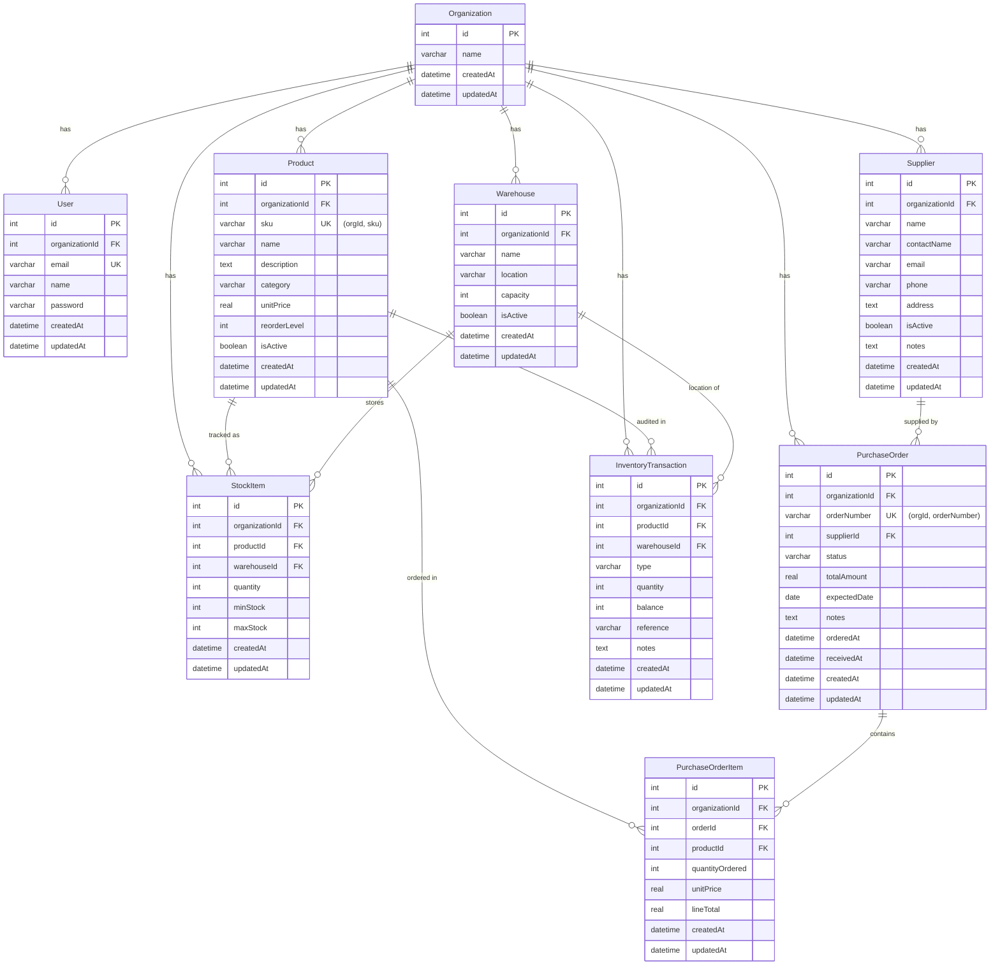

# Database Schema Reference

> Full documentation of the 9 entities, their relationships, constraints, and indexing strategy for the Inventory Manager multi-tenant system.

---

## Entity-Relationship Diagram (ERD)



---

## Entity Definitions

### 1. Organization

Parent entity for multi-tenant isolation. Each organization owns all other entities.

| Column | Type | Constraints | Notes |
|---|---|---|---|
| `id` | `int` | `PRIMARY KEY` `AUTO_INCREMENT` | — |
| `name` | `varchar(255)` | `NOT NULL` | Organization name |
| `createdAt` | `datetime` | `NOT NULL` `DEFAULT NOW()` | — |
| `updatedAt` | `datetime` | `NOT NULL` `DEFAULT NOW()` | — |

**Relationships:**
- `users` → `User[]` (OneToMany)
- `products` → `Product[]` (OneToMany)
- `warehouses` → `Warehouse[]` (OneToMany)
- `stockItems` → `StockItem[]` (OneToMany)
- `suppliers` → `Supplier[]` (OneToMany)
- `purchaseOrders` → `PurchaseOrder[]` (OneToMany)
- `inventoryTransactions` → `InventoryTransaction[]` (OneToMany)

---

### 2. User

Represents a user within an organization. Multi-tenant JWT tokens embed `organizationId`.

| Column | Type | Constraints | Notes |
|---|---|---|---|
| `id` | `int` | `PRIMARY KEY` `AUTO_INCREMENT` | — |
| `organizationId` | `int` | `NOT NULL` `FK → Organization.id` | Tenant isolation |
| `email` | `varchar(255)` | `NOT NULL` `UNIQUE` | Login identifier |
| `name` | `varchar(255)` | `NOT NULL` | Display name |
| `password` | `varchar(255)` | `NOT NULL` | bcrypt-hashed |
| `createdAt` | `datetime` | `NOT NULL` | — |
| `updatedAt` | `datetime` | `NOT NULL` | — |

**Unique Constraints:** `email` (global — no two users can share an email, even across orgs)

---

### 3. Product

Products belong to an organization. SKU uniqueness is enforced per-organization.

| Column | Type | Constraints | Notes |
|---|---|---|---|
| `id` | `int` | `PRIMARY KEY` `AUTO_INCREMENT` | — |
| `organizationId` | `int` | `NOT NULL` `FK → Organization.id` | Tenant isolation |
| `sku` | `varchar(100)` | `NOT NULL` | Stock keeping unit code |
| `name` | `varchar(255)` | `NOT NULL` | Product name |
| `description` | `text` | `NULLABLE` | Long description |
| `category` | `varchar(100)` | `NULLABLE` | Product category |
| `unitPrice` | `real` | `NOT NULL` | Current unit price |
| `reorderLevel` | `int` | `NULLABLE` | Quantity threshold for low-stock alerts |
| `isActive` | `boolean` | `NOT NULL` `DEFAULT true` | Soft-delete flag |
| `createdAt` | `datetime` | `NOT NULL` | — |
| `updatedAt` | `datetime` | `NOT NULL` | — |

**Unique Constraints:** `(organizationId, sku)` — one SKU per organization

---

### 4. Warehouse

Physical or logical storage locations within an organization.

| Column | Type | Constraints | Notes |
|---|---|---|---|
| `id` | `int` | `PRIMARY KEY` `AUTO_INCREMENT` | — |
| `organizationId` | `int` | `NOT NULL` `FK → Organization.id` | Tenant isolation |
| `name` | `varchar(255)` | `NOT NULL` | Warehouse name |
| `location` | `varchar(255)` | `NULLABLE` | Physical address |
| `capacity` | `int` | `NULLABLE` | Maximum capacity (units) |
| `isActive` | `boolean` | `NOT NULL` `DEFAULT true` | Soft-delete flag |
| `createdAt` | `datetime` | `NOT NULL` | — |
| `updatedAt` | `datetime` | `NOT NULL` | — |

---

### 5. StockItem

Separate entity from Product to support multi-warehouse inventory. Tracks quantity, min/max stock per product per warehouse.

| Column | Type | Constraints | Notes |
|---|---|---|---|
| `id` | `int` | `PRIMARY KEY` `AUTO_INCREMENT` | — |
| `organizationId` | `int` | `NOT NULL` `FK → Organization.id` | Tenant isolation |
| `productId` | `int` | `NOT NULL` `FK → Product.id` `ON DELETE CASCADE` | — |
| `warehouseId` | `int` | `NOT NULL` `FK → Warehouse.id` `ON DELETE CASCADE` | — |
| `quantity` | `int` | `NOT NULL` `DEFAULT 0` | Current stock level |
| `minStock` | `int` | `NOT NULL` `DEFAULT 0` | Low-stock threshold |
| `maxStock` | `int` | `NULLABLE` | Maximum desired stock |
| `createdAt` | `datetime` | `NOT NULL` | — |
| `updatedAt` | `datetime` | `NOT NULL` | — |

**Unique Constraints:** `(organizationId, productId, warehouseId)` — one stock record per product per warehouse per org

---

### 6. Supplier

Vendor/supplier information managed per organization.

| Column | Type | Constraints | Notes |
|---|---|---|---|
| `id` | `int` | `PRIMARY KEY` `AUTO_INCREMENT` | — |
| `organizationId` | `int` | `NOT NULL` `FK → Organization.id` | Tenant isolation |
| `name` | `varchar(255)` | `NOT NULL` | Company name |
| `contactName` | `varchar(255)` | `NULLABLE` | Person of contact |
| `email` | `varchar(255)` | `NULLABLE` | Contact email |
| `phone` | `varchar(50)` | `NULLABLE` | Phone number |
| `address` | `text` | `NULLABLE` | Business address |
| `isActive` | `boolean` | `NOT NULL` `DEFAULT true` | Toggle active/inactive |
| `notes` | `text` | `NULLABLE` | Internal notes |
| `createdAt` | `datetime` | `NOT NULL` | — |
| `updatedAt` | `datetime` | `NOT NULL` | — |

---

### 7. PurchaseOrder

Purchase orders track procurement from suppliers with lifecycle: `pending → sent → received` or `cancelled`.

| Column | Type | Constraints | Notes |
|---|---|---|---|
| `id` | `int` | `PRIMARY KEY` `AUTO_INCREMENT` | — |
| `organizationId` | `int` | `NOT NULL` `FK → Organization.id` | Tenant isolation |
| `orderNumber` | `varchar(100)` | `NOT NULL` | Auto-generated: `PO-00001` |
| `supplierId` | `int` | `NOT NULL` `FK → Supplier.id` | — |
| `status` | `varchar(20)` | `NOT NULL` `DEFAULT 'pending'` | `pending | sent | received | cancelled` |
| `totalAmount` | `real` | `NOT NULL` `DEFAULT 0` | Sum of all line totals |
| `expectedDate` | `date` | `NULLABLE` | Expected delivery date |
| `notes` | `text` | `NULLABLE` | Order notes |
| `orderedAt` | `datetime` | `NULLABLE` | Set when status → `sent` |
| `receivedAt` | `datetime` | `NULLABLE` | Set when status → `received` |
| `createdAt` | `datetime` | `NOT NULL` | — |
| `updatedAt` | `datetime` | `NOT NULL` | — |

**Unique Constraints:** `(organizationId, orderNumber)` — unique per organization

**Status Transition Rules:**
```
pending ──→ sent ──→ received
   │                    │
   └──→ cancelled  ←────┘
```

---

### 8. PurchaseOrderItem

Line items within a purchase order. Cascade-deletes with parent order.

| Column | Type | Constraints | Notes |
|---|---|---|---|
| `id` | `int` | `PRIMARY KEY` `AUTO_INCREMENT` | — |
| `organizationId` | `int` | `NOT NULL` `FK → Organization.id` | Tenant isolation |
| `orderId` | `int` | `NOT NULL` `FK → PurchaseOrder.id` `ON DELETE CASCADE` | — |
| `productId` | `int` | `NOT NULL` `FK → Product.id` | — |
| `quantityOrdered` | `int` | `NOT NULL` | Units ordered |
| `unitPrice` | `real` | `NOT NULL` | Price per unit at order time |
| `lineTotal` | `real` | `NOT NULL` | Pre-calculated: `quantityOrdered * unitPrice` |
| `createdAt` | `datetime` | `NOT NULL` | — |
| `updatedAt` | `datetime` | `NOT NULL` | — |

---

### 9. InventoryTransaction

Audit log for every stock movement. Immutable after creation.

| Column | Type | Constraints | Notes |
|---|---|---|---|
| `id` | `int` | `PRIMARY KEY` `AUTO_INCREMENT` | — |
| `organizationId` | `int` | `NOT NULL` `FK → Organization.id` | Tenant isolation |
| `productId` | `int` | `NOT NULL` `FK → Product.id` | Affected product |
| `warehouseId` | `int` | `NOT NULL` `FK → Warehouse.id` | Affected warehouse |
| `type` | `varchar(20)` | `NOT NULL` | `in | out | adjust` |
| `quantity` | `int` | `NOT NULL` | Delta quantity |
| `balance` | `int` | `NOT NULL` | Resulting balance after transaction |
| `reference` | `varchar(255)` | `NULLABLE` | Source (e.g., "Order #PO-00001", "Manual adjustment") |
| `notes` | `text` | `NULLABLE` | Additional context |
| `createdAt` | `datetime` | `NOT NULL` | — |
| `updatedAt` | `datetime` | `NOT NULL` | — |

---

## Multi-Tenant Isolation Strategy

Every data entity (excluding `Organization` itself) includes an `organizationId` column that acts as the tenant discriminator.

**Enforcement points:**
1. **JWT Token** — The `organizationId` is embedded in every JWT token at login/registration
2. **Guard** — `JwtAuthGuard` validates the token and populates `req.user.organizationId`
3. **Service Layer** — Every repository query includes `where: { organizationId }` scoping
4. **Unique Constraints** — Composite unique keys include `organizationId` (e.g., `(organizationId, sku)`, `(organizationId, productId, warehouseId)`)

This ensures absolute data isolation: no query can accidentally access another tenant's data.

---

## Index Strategy

| Table | Index | Type | Purpose |
|---|---|---|---|
| `users` | `email` | UNIQUE | Fast login lookup |
| `users` | `organizationId` | INDEX | Org-scoped queries |
| `products` | `(organizationId, sku)` | UNIQUE | Prevent duplicate SKU per org |
| `products` | `(organizationId, category)` | INDEX | Category filter |
| `stock_items` | `(organizationId, productId, warehouseId)` | UNIQUE | One record per product/warehouse |
| `stock_items` | `(organizationId, productId)` | INDEX | Stock lookup by product |
| `stock_items` | `(organizationId, warehouseId)` | INDEX | Stock lookup by warehouse |
| `purchase_orders` | `(organizationId, orderNumber)` | UNIQUE | Unique order numbers per org |
| `purchase_orders` | `(organizationId, status)` | INDEX | Status filter |
| `inventory_transactions` | `(organizationId, productId)` | INDEX | Transaction history by product |
| `inventory_transactions` | `(organizationId, createdAt)` | INDEX | Date-range queries |

TypeORM `synchronize: true` creates indexes automatically based on entity decorators. The composite unique constraints are defined via `@Unique()` decorators.

---

## PostgreSQL Compatibility Notes

The schema is designed to be fully PostgreSQL-compatible. To switch:

1. **Change `app.module.ts` TypeORM config:**
   ```typescript
   TypeOrmModule.forRootAsync({
     useFactory: (config: ConfigService) => ({
       type: 'postgres',
       host: config.get('DB_HOST', 'localhost'),
       port: config.get('DB_PORT', 5432),
       username: config.get('DB_USER', 'postgres'),
       password: config.get('DB_PASS', ''),
       database: config.get('DB_NAME', 'inventory'),
       entities: [__dirname + '/**/*.entity{.ts,.js}'],
       synchronize: false, // Use migrations in production
     }),
     ...
   })
   ```

2. **Environment variables** — Add `DB_HOST`, `DB_PORT`, `DB_USER`, `DB_PASS`, `DB_NAME`

3. **Migrations** — Use TypeORM CLI: `npx typeorm migration:generate`

**Compatibility notes:**
- `real` type → PostgreSQL `real` / `float4` (ok for prices with small precision needs)
- `boolean` → PostgreSQL `boolean`
- `varchar` → PostgreSQL `character varying`
- `text` → PostgreSQL `text`
- `datetime` → PostgreSQL `timestamp without time zone`
- `int` → PostgreSQL `integer`

---

## Migration Approach

### Development

```typescript
// app.module.ts
synchronize: true
```

TypeORM auto-creates/alters tables on every application start. This is safe for development because the database is SQLite and re-seeded on demand.

### Production (PostgreSQL)

```typescript
synchronize: false
```

Use TypeORM migrations:
```bash
# Generate migration from entity changes
npx typeorm migration:generate -n MigrationName

# Run migrations
npx typeorm migration:run

# Revert last migration
npx typeorm migration:revert
```

---

## Seed Data

The `SeedModule` + `SeedService` auto-populate demo data on first launch:

- 1 Organization: "Demo Company"
- 1 User: `admin@demo.com` / `admin123`
- 3 Warehouses: Main Warehouse, East Distribution, Cold Storage
- 10 Products across 6 categories (Electronics, Hardware, Chemicals, Parts, Tools, Supplies)
- 5 Suppliers with contact information
- 3 Purchase Orders in various states (received, sent, pending)
- 4 Sample Inventory Transactions
